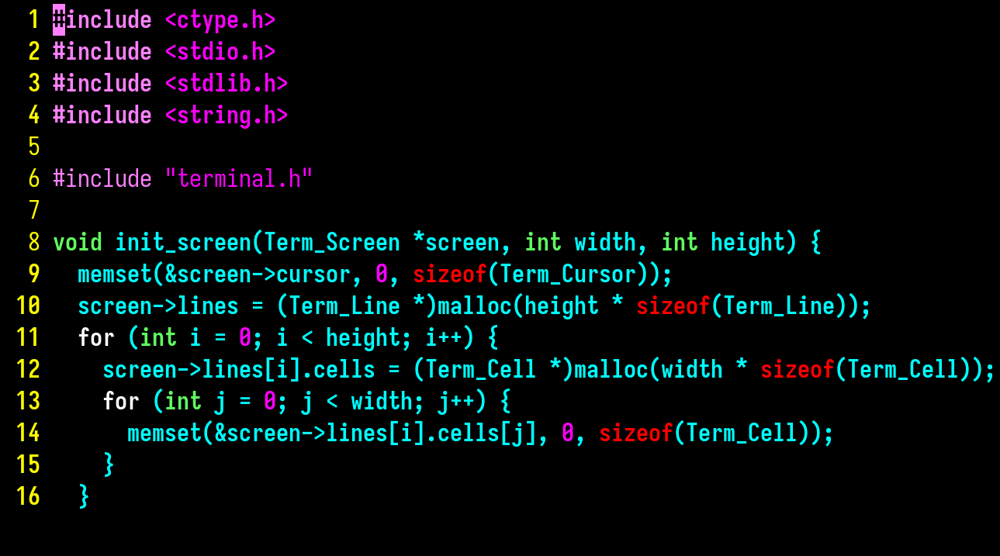

## Overview

This is a lightweight terminal emulator written in C using the X11 and Xft
libraries for rendering. It implements a substantial subset of the VT100/VT220
and ANSI escape code standards, supporting features such as alternate screen
buffers, mouse reporting, bracketed paste, and a scrollback buffer.

The emulator forks a child shell process and communicates with it through a
pseudoterminal (PTY), relaying input and output between the shell and the
graphical window. Double buffering via an X11 Pixmap keeps rendering
artifact-free even during rapid screen updates.

## Screenshots

<p align="center">
  
</p>

## Features

- VT100/VT220 and ANSI escape code support
- 16-color, 256-color, and true-color (RGB) rendering via Xft
- Scrollback buffer (1000 lines)
- Alternate screen buffer support
- Mouse reporting (click, button+motion, and any-motion modes with SGR extension)
- Text selection and clipboard integration (PRIMARY and CLIPBOARD)
- Blinking cursor
- Bracketed paste mode
- Bold text with a separate bold font
- Configurable font, font size, foreground/background colors, and palette
- Double-buffered rendering to eliminate flicker

## Usage

```
Usage: ./build/gui [OPTIONS]
Options:
  --font-size SIZE      Set font size (default: 14)
  --scrollback N        Scrollback buffer size (default: 1000)
  --font PATTERN        Fontconfig font pattern (e.g. 'Monospace')
  --fg RRGGBB           Default foreground color (hex, default: ffffff)
  --bg RRGGBB           Default background color (hex, default: 000000)
  --color N RRGGBB      Override palette color N (0-15) with hex value
  --log-file FILE       Write logs to FILE instead of stdout
  --margin N            Set window margin in pixels (default: 10)
  --alpha N             Window opacity 0-255 (default: 255, requires compositor)
  --title TEXT          Initial window title
  --size COLSxROWS      Initial window size in character cells (e.g. 220x50)
  --help                Show this help message
```

## Dependencies

```
gcc
libx11-dev
libxft-dev
libxrender-dev
make
```

## License

This work is licensed under the GNU General Public License version 3 (GPLv3).

[](https://www.gnu.org/licenses/gpl-3.0.en.html)
